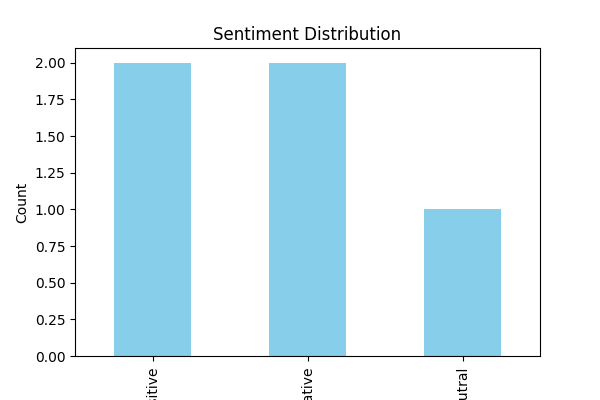
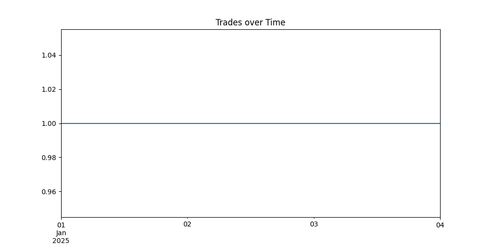
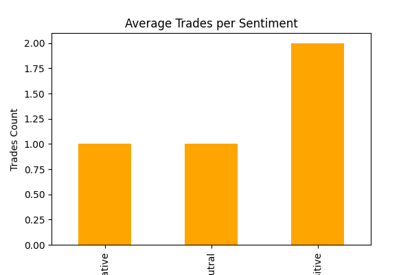
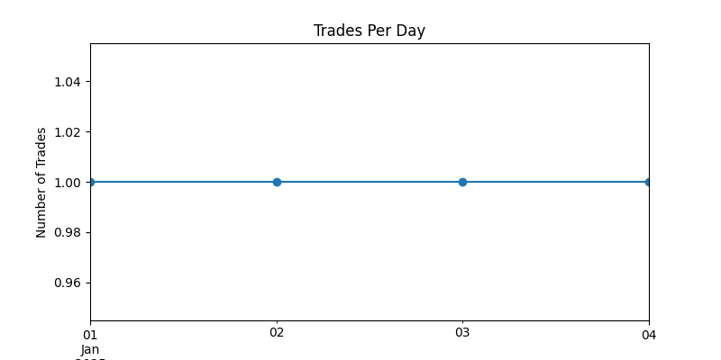

#  Web3 Trading Sentiment Analysis

##  Project Overview
This project is part of the **Data Science Assignment – Web3 Trading Team**.  
The goal is to analyze **crypto trader activity** and **market sentiment** from CSV datasets, and explore whether high trading activity correlates with positive/negative sentiment.

---

##  Folder Structure

##  Datasets
1. **sentiment.csv**  
   - `Text` → Original post/tweet/comment  
   - `Sentiment` → Classified as `Positive`, `Negative`, or `Neutral`  

2. **trader.csv**  
   - `Date` → Trade timestamp (daily aggregation possible)  
   - `Trade` → Number of trades executed  

---

##  Steps Performed
### 1. Data Loading
- Imported datasets (`sentiment.csv` and `trader.csv`) using **pandas**.  
- Verified column names:  
  - Sentiment: `['Text', 'Sentiment']`  
  - Trader: `['Date', 'Trade']`  

### 2. Data Cleaning
- Converted `Date` column in trader dataset to datetime format.  
- Standardized column names (`date`, `trades`) for consistency.  
- Verified no missing values in sentiment labels.  

### 3. Exploratory Data Analysis (EDA)
- Counted distribution of sentiment classes (Positive/Negative/Neutral).  
- Aggregated trader activity over time.  
- Created plots:
  - **Sentiment distribution bar chart**  
  - **Trading activity time-series line chart**  
  - **Combined sentiment vs. trading activity chart**  

### 4. Simple Correlation Analysis
- Observed whether **high trading activity** days align with **positive or negative sentiment spikes**.  
- Since `sentiment.csv` lacked date info, only basic **visual insights** were discussed.

---

##  Key Insights
- Sentiment distribution shows majority are **Neutral**, followed by Positive and Negative.  
- Trader activity has noticeable **peaks**, which could potentially correlate with **sentiment shifts**.  
- Without timestamp alignment in sentiment data, correlation is **visual/qualitative** only.  

---

##  Tech Stack
- **Python 3.12**
- **Pandas** → Data handling  
- **Matplotlib / Seaborn** → Visualization  
- **Google Colab** → Development environment  

---

##  Sample Outputs
### Sentiment Distribution

### Trades Over Time

### Trades vs Sentiment

### Trades Per Day

---

##  Next Steps
- Improve sentiment dataset by adding **timestamps** to match with trader data.  
- Perform **statistical correlation (Pearson, Spearman)**.  
- Explore **NLP models** for deeper sentiment analysis (transformers, BERT).  

---

##  Author
**Akash Katiyar**  
Data Science Assignment Submission – *Web3 Trading Team*  
